# commercetools Visualizer
The commercetools Visualizer is a [custom application](https://docs.commercetools.com/merchant-center-customizations/custom-applications) related to non-standard types within the commercetools Merchant Center. It supports rendering and editing Subscriptions, API Extensions, Types, States and Custom Objects.

## Introduction

This repository contains components rendering non out-of-the-box types as a custom app. Currently these are:
 * [API Extensions](https://docs.commercetools.com/api/projects/api-extensions)
 * [States](https://docs.commercetools.com/api/projects/states)
 * [Subscriptions](https://docs.commercetools.com/api/projects/subscriptions)
 * [Types](https://docs.commercetools.com/api/projects/types)
 * [Custom Objects](https://docs.commercetools.com/api/projects/custom-objects)

## Installation
The commercetools Visualizer is pre-packaged to run as a connect application. Follow the public documentation on how to run a custom merchant center application in connect and how to configure it in Merchant Center.

## Screenshots

### Home Screen

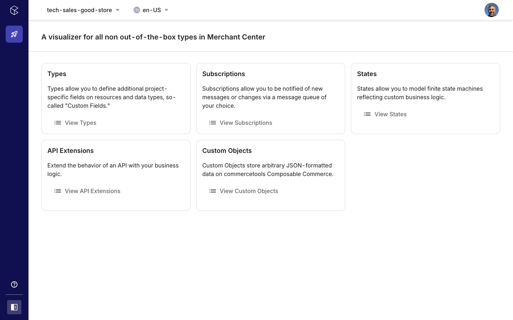

### API Extensions

List View
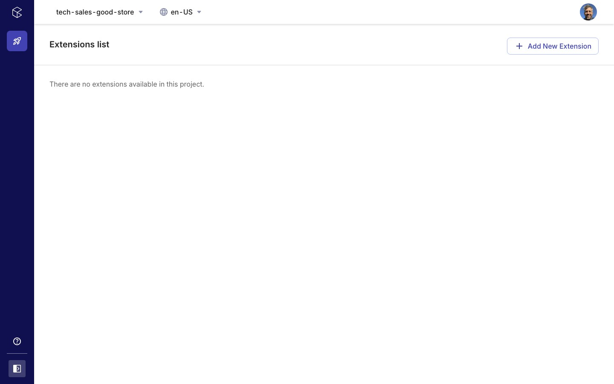
New View
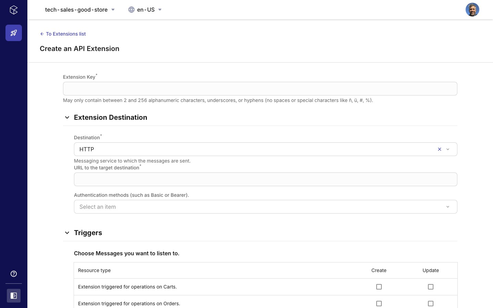

### States

List View
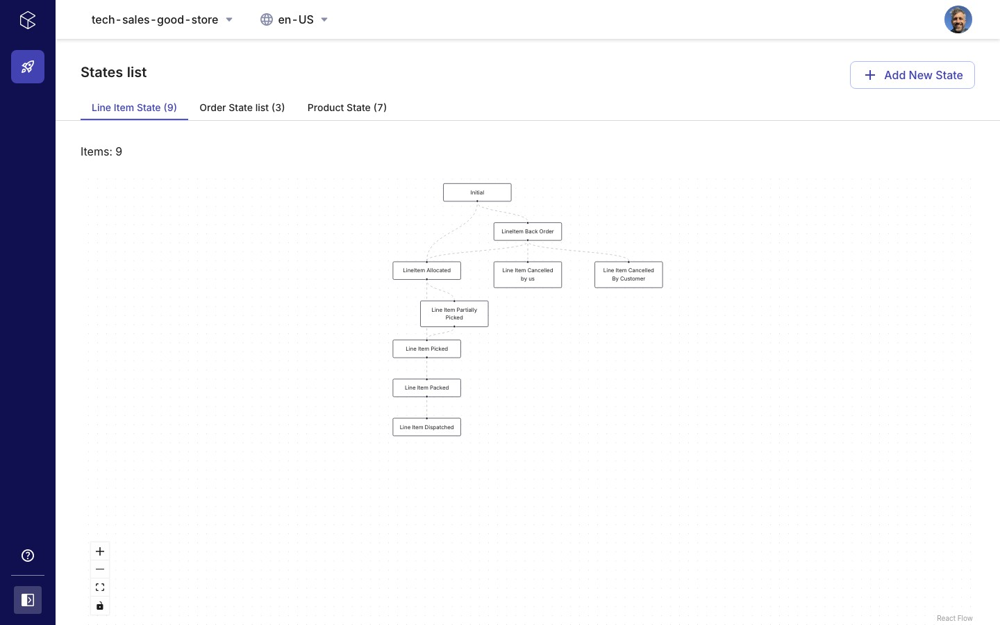
Detail View
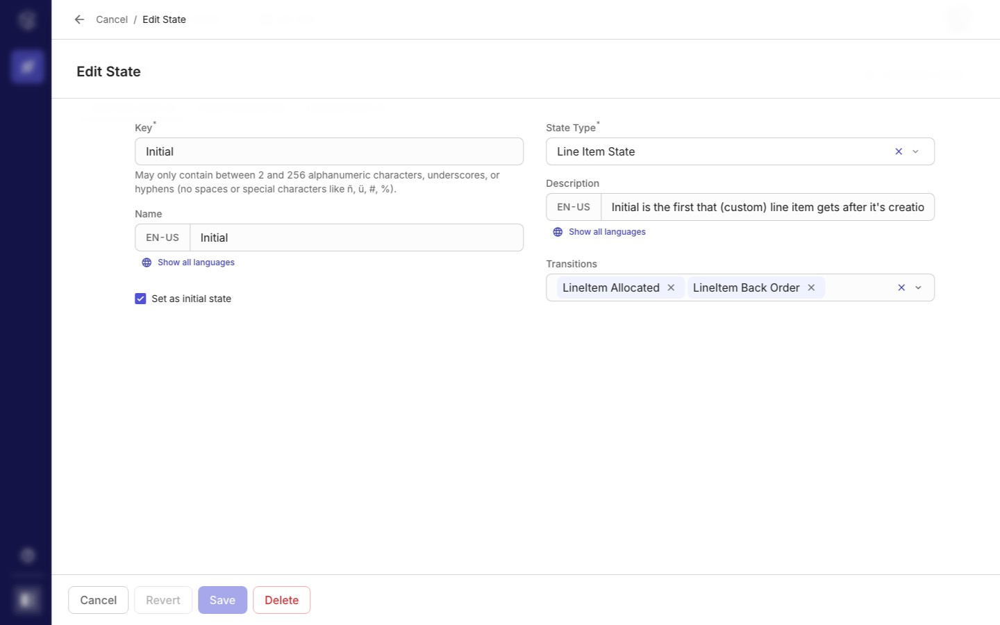
New View
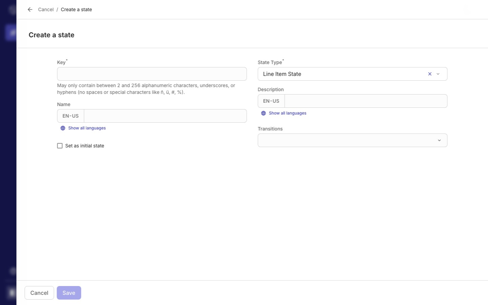

### Subscriptions

List View
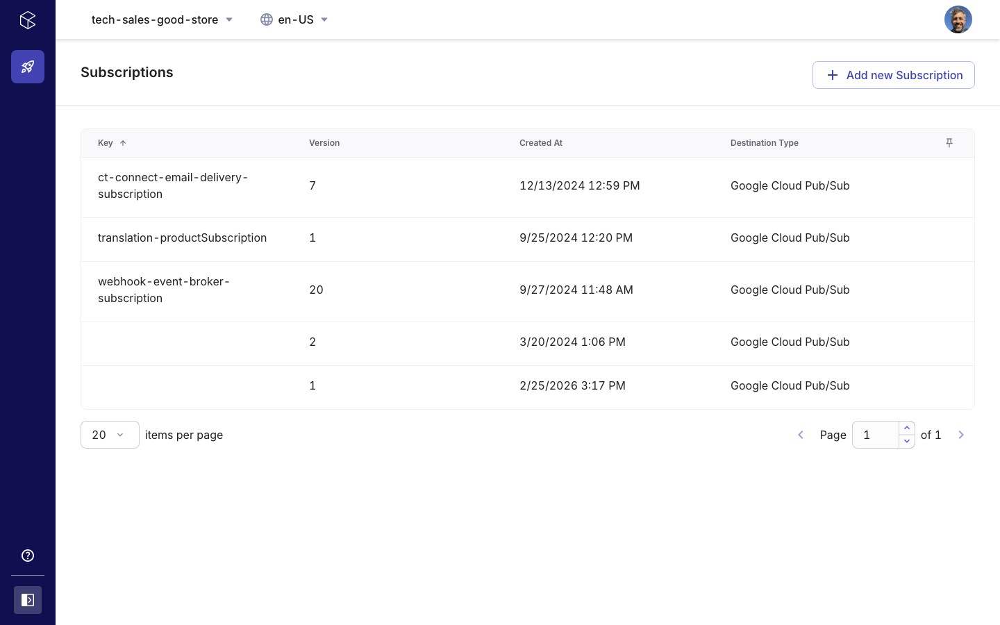
Detail View
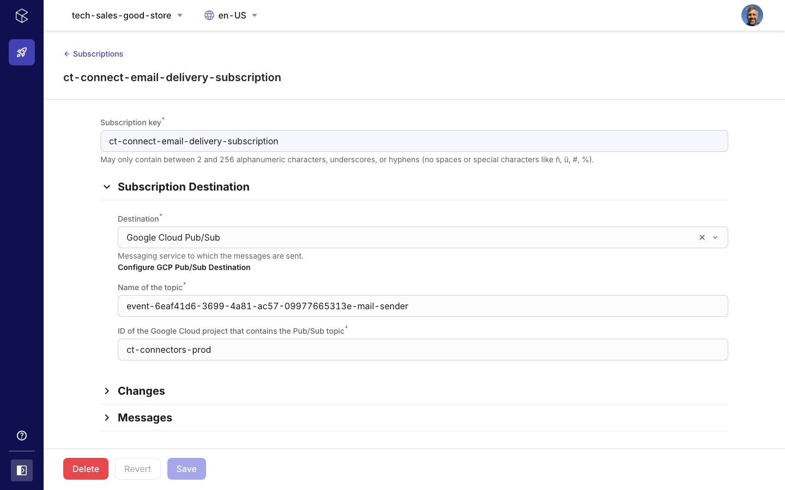
New View
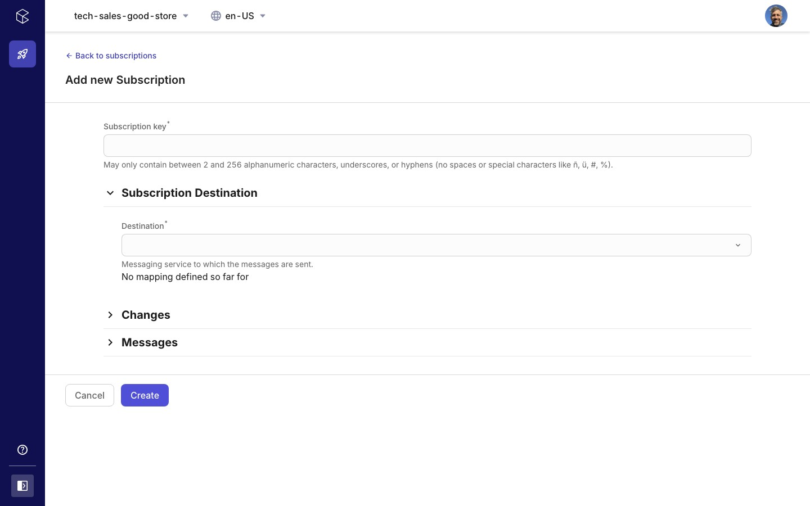

### Types

List View
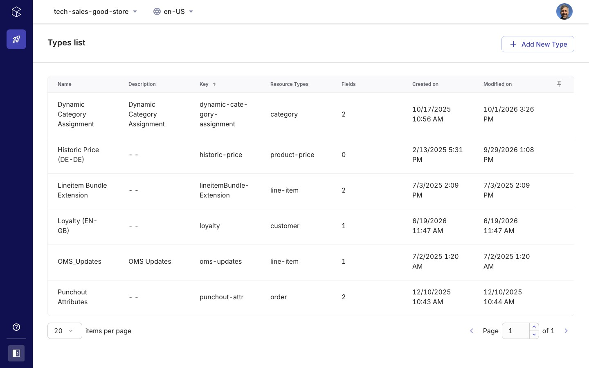
Detail View
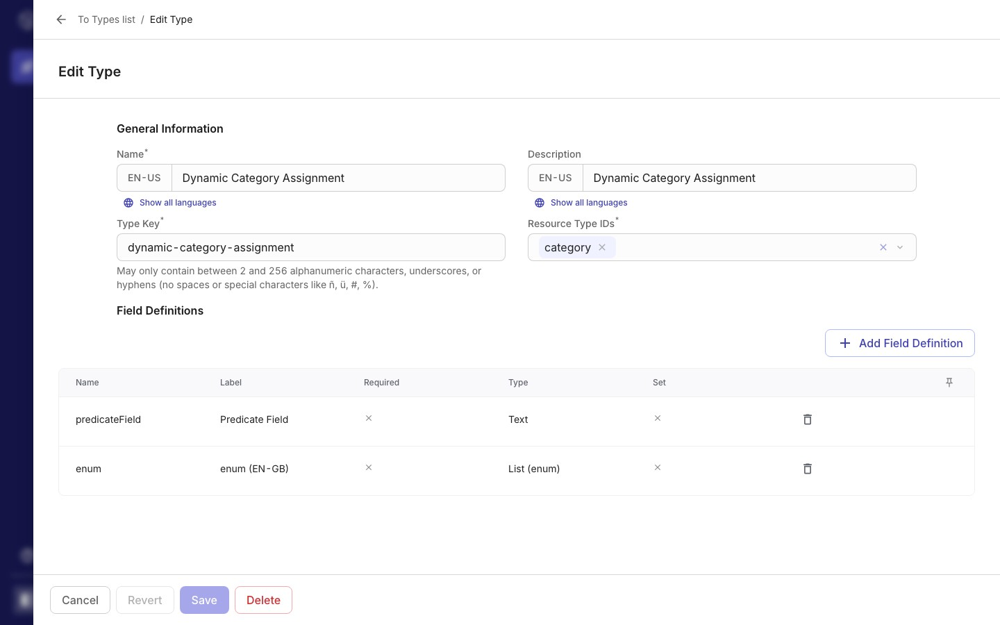
New View
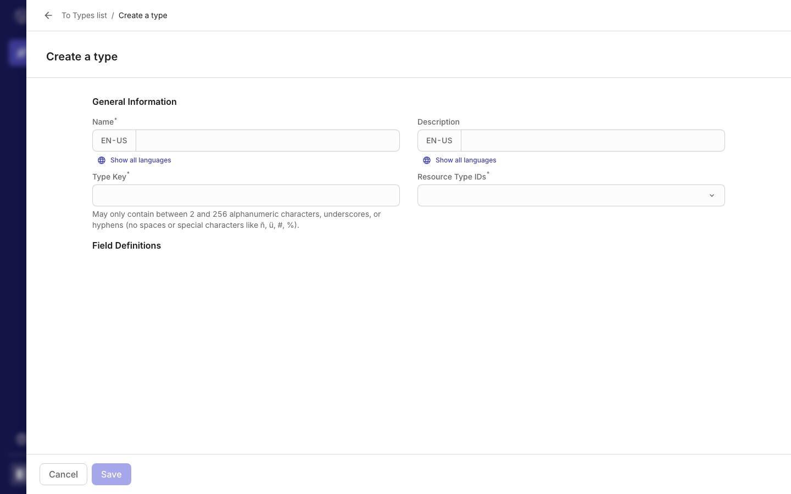

### Custom Objects

List View
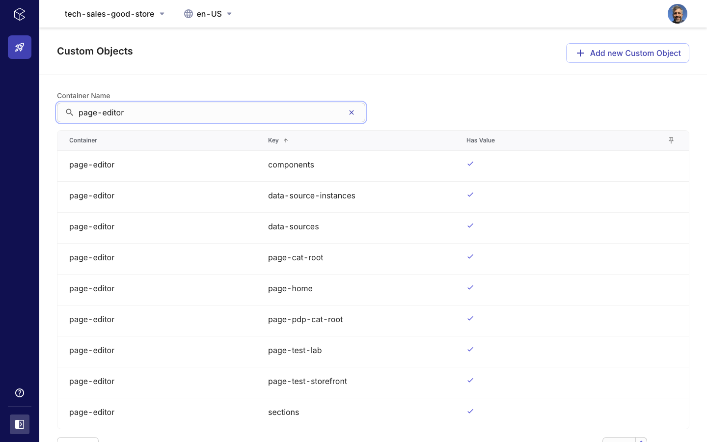
Detail View
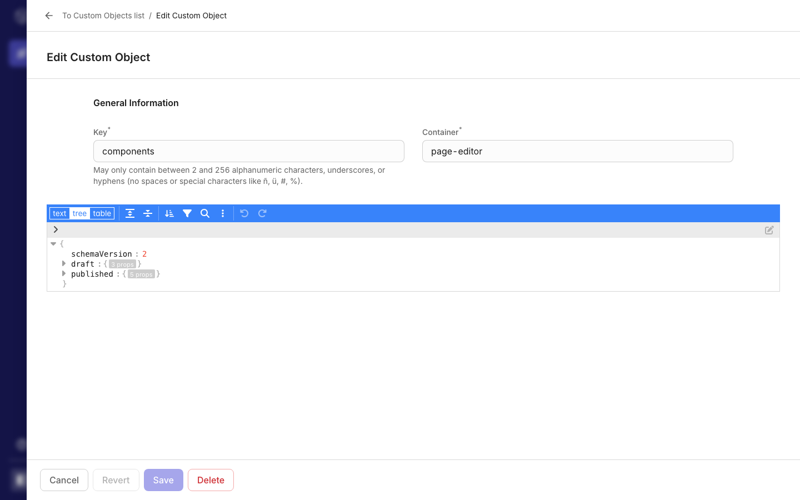

## Local Development

Create a file .env.local within the folder [visualizer](./visualizer) folder like:
```dotenv    
CLOUD_IDENTIFIER=gcp-eu
CUSTOM_APPLICATION_ID=TODO
APPLICATION_URL=https://your_app_hostname.com
INITIAL_PROJECT_KEY=YOUR_PROJECT_KEY
```
Run the following commands

```shell    
cd ./visualizer
npm install
npm run start
```

The code has been built successfully using
* Node v22.16.0
* npm 10.9.2

## Known issues
 - On Types: a field definition's `required` flag can only be set when the field is created; the commercetools API has no update action for it, so changing it on an existing field has no effect.
 - On Subscriptions: the subscription `format` (Platform / CloudEvents) and `status` are not exposed.

## Development

```shell
cd ./visualizer
npm test            # jest
npm run typecheck   # tsc --noEmit
npm run lint
```

The docs screenshots can be regenerated with the Playwright scripts in [visualizer/scripts/screenshots](./visualizer/scripts/screenshots).
